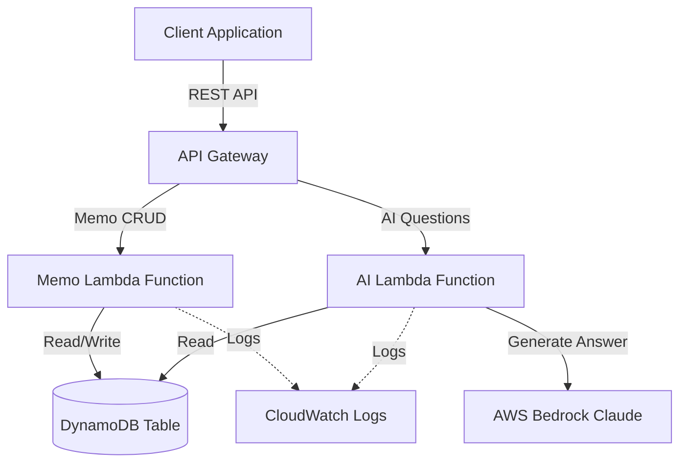

# Design Document: AI要約API

## Overview

The AI要約API is a serverless RESTful API service built on AWS that enables users to create, manage, and query memos using AI-powered question answering. The system leverages AWS Bedrock Claude for natural language processing and follows AWS serverless best practices for scalability, cost-efficiency, and maintainability.

### Key Design Goals

- **Serverless-first architecture**: Utilize AWS managed services to minimize operational overhead
- **Single-purpose Lambda functions**: Each function handles a specific domain responsibility
- **Performance optimization**: Meet strict latency requirements (200ms for CRUD, 30s for AI operations)
- **Cost efficiency**: Pay-per-use model with DynamoDB on-demand pricing
- **Observability**: Comprehensive logging, metrics, and distributed tracing
- **Scalability**: Automatic scaling to handle variable workloads

### Technology Stack

- **Runtime**: Python 3.13 (AWS Lambda)
- **API Layer**: Amazon API Gateway (REST API)
- **Compute**: AWS Lambda
- **Storage**: Amazon DynamoDB (single-table design)
- **AI Service**: AWS Bedrock (Claude Sonnet 4.6 via inference profile)
- **Monitoring**: Amazon CloudWatch
- **IaC**: AWS SAM (Serverless Application Model)
- **SDK**: boto3, aws-lambda-powertools
- **Deployment Region**: us-west-2 (Oregon)

## Architecture

### High-Level Architecture



### Architecture Decisions

#### 1. Single-Table DynamoDB Design

We use a single DynamoDB table for all memo data to:
- Minimize costs (fewer tables = lower base costs)
- Simplify access patterns (all memo operations use consistent key structure)
- Enable efficient queries with GSI for sorting by update timestamp

**Rationale**: The application has a simple data model with one primary entity (Memo). A single-table design provides optimal performance and cost efficiency for this use case.

#### 2. Separate Lambda Functions for Memo and AI Operations

We separate memo CRUD operations from AI operations because:
- Different performance characteristics (CRUD: 200ms, AI: 30s)
- Different resource requirements (AI needs more memory/timeout)
- Different retry strategies (AI requires exponential backoff)
- Clearer separation of concerns and easier maintenance

**Rationale**: Single-purpose functions align with serverless best practices and enable independent scaling and optimization.

#### 3. API Gateway Request Validation

We implement validation at the API Gateway level to:
- Reject invalid requests before Lambda invocation (cost savings)
- Provide consistent error responses
- Reduce Lambda execution time

**Rationale**: Early validation reduces unnecessary compute costs and improves response times for invalid requests.

#### 4. AWS Bedrock Claude for AI

We use AWS Bedrock instead of external AI services to:
- Keep all data within AWS infrastructure (security)
- Leverage AWS IAM for access control
- Benefit from AWS regional availability
- Simplify billing and cost tracking

**Rationale**: Native AWS integration provides better security, compliance, and operational simplicity.

## Components and Interfaces

### 1. API Gateway

**Responsibility**: HTTP request routing, request validation, response formatting

**Endpoints**:

```
POST   /memos              - Create a new memo
GET    /memos/{id}         - Retrieve a specific memo
GET    /memos              - List all memos (with pagination)
PUT    /memos/{id}         - Update a memo
DELETE /memos/{id}         - Delete a memo
POST   /memos/{id}/ask     - Ask AI a question about a memo
```

**Configuration**:
- Enable CORS for web client access
- Request validation using JSON Schema
- API Gateway caching disabled (data freshness priority)
- CloudWatch logging enabled (INFO level)

**Request Validation Rules**:
- Title: 1-200 characters, required for create/update
- Content: 1-50000 characters, required for create/update
- Question: 1-1000 characters, required for AI questions
- Pagination: page_size (1-100, default 20), next_token (optional)

### 2. Memo Lambda Function

**Responsibility**: Handle all memo CRUD operations

**Handler Structure**:
```python
def lambda_handler(event, context):
    # Route based on HTTP method and path
    # POST /memos -> create_memo()
    # GET /memos/{id} -> get_memo()
    # GET /memos -> list_memos()
    # PUT /memos/{id} -> update_memo()
    # DELETE /memos/{id} -> delete_memo()
```

**Configuration**:
- Runtime: Python 3.13
- Memory: 512 MB
- Timeout: 10 seconds
- Environment Variables:
  - `MEMO_TABLE_NAME`: DynamoDB table name
  - `LOG_LEVEL`: Logging level (INFO)
  - `POWERTOOLS_SERVICE_NAME`: memo-service

**IAM Permissions**:
- `dynamodb:PutItem` (create)
- `dynamodb:GetItem` (read)
- `dynamodb:Query` (list with GSI)
- `dynamodb:UpdateItem` (update)
- `dynamodb:DeleteItem` (delete)
- `logs:CreateLogGroup`, `logs:CreateLogStream`, `logs:PutLogEvents`

**Dependencies**:
- boto3 (AWS SDK)
- aws-lambda-powertools (logging, tracing, metrics)

### 3. AI Lambda Function

**Responsibility**: Process AI questions using AWS Bedrock Claude

**Handler Structure**:
```python
def lambda_handler(event, context):
    # Extract memo_id and question from request
    # Retrieve memo from DynamoDB
    # Call AWS Bedrock Claude with memo content and question
    # Return AI-generated answer with metadata
```

**Configuration**:
- Runtime: Python 3.13
- Memory: 1024 MB (higher for AI processing)
- Timeout: 35 seconds (30s for AI + 5s buffer)
- Environment Variables:
  - `MEMO_TABLE_NAME`: DynamoDB table name
  - `BEDROCK_MODEL_ID`: us.anthropic.claude-sonnet-4-6 (inference profile)
  - `BEDROCK_REGION`: us-west-2
  - `MAX_RETRIES`: 3
  - `LOG_LEVEL`: INFO
  - `POWERTOOLS_SERVICE_NAME`: ai-service

**IAM Permissions**:
- `dynamodb:GetItem` (read memo)
- `bedrock:InvokeModel` (call Claude)
- `logs:CreateLogGroup`, `logs:CreateLogStream`, `logs:PutLogEvents`

**Retry Strategy**:
- Exponential backoff: 1s, 2s, 4s
- Retry on: ThrottlingException, ServiceUnavailableException
- No retry on: ValidationException, AccessDeniedException

**Dependencies**:
- boto3 (AWS SDK)
- aws-lambda-powertools (logging, tracing, metrics)

### 4. DynamoDB Table

**Responsibility**: Persistent storage for memo data

**Table Design** (Single-Table):

**Primary Key**:
- Partition Key: `PK` (String) - Format: `MEMO#{memo_id}`
- Sort Key: None (simple key schema)

**Attributes**:
- `PK`: Partition key (e.g., "MEMO#123e4567-e89b-12d3-a456-426614174000")
- `id`: Memo UUID (String)
- `title`: Memo title (String, 1-200 chars)
- `content`: Memo content (String, 1-50000 chars)
- `created_at`: ISO 8601 timestamp (String)
- `updated_at`: ISO 8601 timestamp (String)

**Global Secondary Index** (for listing by update time):
- Index Name: `UpdatedAtIndex`
- Partition Key: `entity_type` (String) - Always "MEMO"
- Sort Key: `updated_at` (String) - ISO 8601 timestamp
- Projection: ALL

**Configuration**:
- Billing Mode: On-Demand (pay-per-request)
- Point-in-time recovery: Enabled
- Encryption: AWS managed keys (SSE)
- TTL: Not enabled (memos persist indefinitely)

**Access Patterns**:
1. Create memo: `PutItem` with PK
2. Get memo by ID: `GetItem` with PK
3. List memos by update time: `Query` on UpdatedAtIndex, descending order
4. Update memo: `UpdateItem` with PK
5. Delete memo: `DeleteItem` with PK

### 5. AWS Bedrock Integration

**Responsibility**: Generate AI answers based on memo content and questions

**Model Selection**: Claude Sonnet 4.6 via inference profile (`us.anthropic.claude-sonnet-4-6`)

**Inference Profile Benefits**:
- Automatic load balancing across multiple AWS regions (us-east-1, us-east-2, us-west-2)
- Higher availability and fault tolerance
- Consistent pricing and performance

**Prompt Structure**:
```
You are a helpful assistant analyzing memo content. 
Based on the following memo, please answer the user's question.

Memo Title: {title}
Memo Content: {content}

User Question: {question}

Please provide a clear and concise answer based only on the information in the memo.
```

**Request Format** (Messages API):
```json
{
  "anthropic_version": "bedrock-2023-05-31",
  "max_tokens": 2000,
  "temperature": 0.7,
  "messages": [
    {
      "role": "user",
      "content": "<prompt>"
    }
  ]
}
```

**Response Handling**:
- Extract answer text from `content[0].text` in response
- Include metadata: model_id, processing_time, memo_id
- Support Japanese and other Unicode characters in responses (`ensure_ascii=False`)
- Handle streaming responses if needed (future enhancement)

## Data Models

### Memo Object

```python
from dataclasses import dataclass
from datetime import datetime
from typing import Optional

@dataclass
class Memo:
    id: str                    # UUID v4
    title: str                 # 1-200 characters
    content: str               # 1-50000 characters
    created_at: datetime       # ISO 8601 format
    updated_at: datetime       # ISO 8601 format
    
    def to_dict(self) -> dict:
        """Convert to dictionary for API response"""
        return {
            'id': self.id,
            'title': self.title,
            'content': self.content,
            'created_at': self.created_at.isoformat(),
            'updated_at': self.updated_at.isoformat()
        }
    
    def to_dynamodb_item(self) -> dict:
        """Convert to DynamoDB item format"""
        return {
            'PK': f'MEMO#{self.id}',
            'id': self.id,
            'title': self.title,
            'content': self.content,
            'created_at': self.created_at.isoformat(),
            'updated_at': self.updated_at.isoformat(),
            'entity_type': 'MEMO'  # For GSI
        }
```

### API Request/Response Models

**Create Memo Request**:
```json
{
  "title": "string (1-200 chars)",
  "content": "string (1-50000 chars)"
}
```

**Create Memo Response** (201 Created):
```json
{
  "id": "uuid",
  "title": "string",
  "content": "string",
  "created_at": "ISO 8601 timestamp",
  "updated_at": "ISO 8601 timestamp"
}
```

**Get Memo Response** (200 OK):
```json
{
  "id": "uuid",
  "title": "string",
  "content": "string",
  "created_at": "ISO 8601 timestamp",
  "updated_at": "ISO 8601 timestamp"
}
```

**List Memos Request** (Query Parameters):
```
?page_size=20&next_token=base64_encoded_token
```

**List Memos Response** (200 OK):
```json
{
  "memos": [
    {
      "id": "uuid",
      "title": "string",
      "content": "string",
      "created_at": "ISO 8601 timestamp",
      "updated_at": "ISO 8601 timestamp"
    }
  ],
  "next_token": "base64_encoded_token or null"
}
```

**Update Memo Request**:
```json
{
  "title": "string (1-200 chars, optional)",
  "content": "string (1-50000 chars, optional)"
}
```

**Update Memo Response** (200 OK):
```json
{
  "id": "uuid",
  "title": "string",
  "content": "string",
  "created_at": "ISO 8601 timestamp",
  "updated_at": "ISO 8601 timestamp"
}
```

**Delete Memo Response** (204 No Content):
```
(empty body)
```

**AI Question Request**:
```json
{
  "question": "string (1-1000 chars)"
}
```

**AI Answer Response** (200 OK):
```json
{
  "answer": "string",
  "metadata": {
    "model_id": "string",
    "processing_time_ms": "number",
    "memo_id": "uuid"
  }
}
```

**Error Response** (4xx, 5xx):
```json
{
  "error": {
    "code": "string (e.g., ValidationError, NotFound, ServiceError)",
    "message": "string (human-readable error description)",
    "request_id": "string (for tracing)"
  }
}
```


## Correctness Properties

*A property is a characteristic or behavior that should hold true across all valid executions of a system-essentially, a formal statement about what the system should do. Properties serve as the bridge between human-readable specifications and machine-verifiable correctness guarantees.*

### Property 1: Title Validation

*For any* memo creation or update request, if the title length is not between 1 and 200 characters (inclusive), then the request SHALL be rejected with a 400 error, and if the title length is within this range, the request SHALL be accepted.

**Validates: Requirements 1.2, 4.2**

### Property 2: Content Validation

*For any* memo creation or update request, if the content length is not between 1 and 50000 characters (inclusive), then the request SHALL be rejected with a 400 error, and if the content length is within this range, the request SHALL be accepted.

**Validates: Requirements 1.3, 4.2**

### Property 3: Question Validation

*For any* AI question request, if the question length is not between 1 and 1000 characters (inclusive), then the request SHALL be rejected with a 400 error, and if the question length is within this range, the request SHALL be accepted.

**Validates: Requirements 6.2**

### Property 4: Invalid Input Error Response

*For any* invalid request (failing validation rules), the API SHALL return a 400 status code with a descriptive error message in the response body.

**Validates: Requirements 1.4**

### Property 5: Create-Read Round Trip

*For any* valid memo (with valid title and content), creating the memo and then immediately retrieving it by its returned ID SHALL return a memo object with the same title and content, along with a generated ID, creation timestamp, and update timestamp.

**Validates: Requirements 1.1, 1.5, 1.6, 2.1**

### Property 6: Update-Read Round Trip with Timestamp Change

*For any* existing memo and valid update data, updating the memo and then immediately retrieving it SHALL return the memo with the updated fields, and the updated_at timestamp SHALL be greater than the original updated_at timestamp.

**Validates: Requirements 4.1, 4.3, 4.4**

### Property 7: Delete-Read Verification

*For any* existing memo, after successfully deleting the memo (receiving 204 status), attempting to retrieve that memo by its ID SHALL return a 404 error.

**Validates: Requirements 5.1, 5.4**

### Property 8: Memo Response Structure Completeness

*For any* successful memo operation (create, read, update), the response SHALL contain all required fields: id (string), title (string), content (string), created_at (ISO 8601 timestamp), and updated_at (ISO 8601 timestamp).

**Validates: Requirements 1.6, 2.2, 4.4**

### Property 9: List Completeness

*For any* set of created memos, listing all memos SHALL return all memos that have been created and not deleted, with no duplicates.

**Validates: Requirements 3.1**

### Property 10: List Sorting Order

*For any* list of memos returned by the list operation, the memos SHALL be sorted by updated_at timestamp in descending order (most recently updated first).

**Validates: Requirements 3.2**

### Property 11: Pagination Page Size Enforcement

*For any* list request, if no page_size is specified, the response SHALL contain at most 20 memos, and if a page_size is specified, it SHALL be capped at 100 memos regardless of the requested value.

**Validates: Requirements 3.3**

### Property 12: Pagination Token Navigation

*For any* list request that returns a next_token, using that next_token in a subsequent request SHALL return the next page of results with no overlap or gaps in the memo sequence.

**Validates: Requirements 3.4**

### Property 13: Non-Existent ID Returns 404

*For any* operation (get, update, delete, ask) performed with a memo ID that does not exist in the system, the API SHALL return a 404 status code with a descriptive error message.

**Validates: Requirements 2.3, 4.5, 5.3, 6.5**

### Property 14: Successful Deletion Status Code

*For any* existing memo, successfully deleting that memo SHALL return a 204 (No Content) status code with an empty response body.

**Validates: Requirements 5.2**

### Property 15: AI Question Returns Answer with Metadata

*For any* valid AI question request with an existing memo ID and valid question, the API SHALL return a response containing an answer field (non-empty string) and a metadata object with model_id, processing_time_ms, and memo_id fields.

**Validates: Requirements 6.1, 6.3, 6.4**

## Error Handling

### Error Categories

#### 1. Client Errors (4xx)

**400 Bad Request**:
- Invalid request body format (malformed JSON)
- Validation failures (title/content/question length violations)
- Missing required fields

**404 Not Found**:
- Memo ID does not exist
- Applies to: GET, PUT, DELETE, POST /ask operations

**429 Too Many Requests**:
- API Gateway throttling limits exceeded
- DynamoDB throttling (should be rare with on-demand pricing)

Error Response Format:
```json
{
  "error": {
    "code": "ValidationError",
    "message": "Title must be between 1 and 200 characters",
    "request_id": "abc-123-def"
  }
}
```

#### 2. Server Errors (5xx)

**500 Internal Server Error**:
- Unexpected Lambda function errors
- DynamoDB service errors (non-throttling)
- Unhandled exceptions

**503 Service Unavailable**:
- AWS Bedrock service unavailable after retries
- Temporary service degradation

**504 Gateway Timeout**:
- Lambda function timeout (should not occur with proper timeout settings)
- AI processing exceeds 30-second limit

Error Response Format:
```json
{
  "error": {
    "code": "ServiceError",
    "message": "An unexpected error occurred. Please try again later.",
    "request_id": "abc-123-def"
  }
}
```

### Error Handling Strategies

#### Lambda Function Error Handling

**Memo Function**:
```python
from aws_lambda_powertools import Logger
from aws_lambda_powertools.utilities.typing import LambdaContext
import json

logger = Logger()

def lambda_handler(event: dict, context: LambdaContext) -> dict:
    try:
        # Route to appropriate handler
        result = route_request(event)
        return {
            'statusCode': result['status_code'],
            'body': json.dumps(result['body']),
            'headers': {'Content-Type': 'application/json'}
        }
    except ValidationError as e:
        logger.warning("Validation error", extra={"error": str(e)})
        return error_response(400, "ValidationError", str(e))
    except MemoNotFoundError as e:
        logger.info("Memo not found", extra={"memo_id": e.memo_id})
        return error_response(404, "NotFound", str(e))
    except Exception as e:
        logger.exception("Unexpected error")
        return error_response(500, "InternalError", "An unexpected error occurred")
```

**AI Function with Retry Logic**:
```python
import time
from botocore.exceptions import ClientError

def invoke_bedrock_with_retry(memo_content: str, question: str, max_retries: int = 3) -> str:
    """Invoke Bedrock with exponential backoff retry"""
    for attempt in range(max_retries):
        try:
            response = bedrock_client.invoke_model(
                modelId=os.environ['BEDROCK_MODEL_ID'],
                body=json.dumps({
                    'prompt': build_prompt(memo_content, question),
                    'max_tokens_to_sample': 2000,
                    'temperature': 0.7
                })
            )
            return parse_bedrock_response(response)
        except ClientError as e:
            error_code = e.response['Error']['Code']
            if error_code in ['ThrottlingException', 'ServiceUnavailableException']:
                if attempt < max_retries - 1:
                    wait_time = 2 ** attempt  # Exponential backoff: 1s, 2s, 4s
                    logger.warning(f"Bedrock error, retrying in {wait_time}s", 
                                 extra={"attempt": attempt + 1, "error": error_code})
                    time.sleep(wait_time)
                else:
                    logger.error("Bedrock retries exhausted")
                    raise ServiceUnavailableError("AI service temporarily unavailable")
            else:
                logger.error("Bedrock non-retryable error", extra={"error": error_code})
                raise
```

#### DynamoDB Error Handling

**Conditional Writes** (for update/delete operations):
```python
def update_memo(memo_id: str, updates: dict) -> dict:
    """Update memo with existence check"""
    try:
        response = dynamodb.update_item(
            TableName=os.environ['MEMO_TABLE_NAME'],
            Key={'PK': f'MEMO#{memo_id}'},
            UpdateExpression='SET title = :title, content = :content, updated_at = :updated_at',
            ConditionExpression='attribute_exists(PK)',  # Ensure memo exists
            ExpressionAttributeValues={
                ':title': updates['title'],
                ':content': updates['content'],
                ':updated_at': datetime.utcnow().isoformat()
            },
            ReturnValues='ALL_NEW'
        )
        return response['Attributes']
    except ClientError as e:
        if e.response['Error']['Code'] == 'ConditionalCheckFailedException':
            raise MemoNotFoundError(memo_id)
        raise
```

### Logging and Observability

**Structured Logging Format**:
```python
# Success log
logger.info("Memo created", extra={
    "operation": "create_memo",
    "memo_id": memo_id,
    "processing_time_ms": processing_time,
    "request_id": context.request_id
})

# Error log
logger.error("Failed to create memo", extra={
    "operation": "create_memo",
    "error_type": type(e).__name__,
    "error_message": str(e),
    "stack_trace": traceback.format_exc(),
    "request_id": context.request_id
})
```

**CloudWatch Metrics**:
```python
from aws_lambda_powertools import Metrics
from aws_lambda_powertools.metrics import MetricUnit

metrics = Metrics(namespace="AIMemoryAPI")

# Emit custom metrics
metrics.add_metric(name="MemoCreated", unit=MetricUnit.Count, value=1)
metrics.add_metric(name="ProcessingTime", unit=MetricUnit.Milliseconds, value=processing_time)
```

## Testing Strategy

### Dual Testing Approach

This project requires both unit testing and property-based testing to ensure comprehensive correctness validation:

- **Unit tests**: Verify specific examples, edge cases, and error conditions
- **Property tests**: Verify universal properties across all inputs using randomized test data

Both approaches are complementary and necessary. Unit tests catch concrete bugs and verify specific scenarios, while property tests verify general correctness across a wide range of inputs.

### Property-Based Testing

**Framework**: We will use **Hypothesis** for Python property-based testing.

**Configuration**:
- Minimum 100 iterations per property test (due to randomization)
- Each test must reference its design document property using a comment tag
- Tag format: `# Feature: ai-summary-api, Property {number}: {property_text}`

**Example Property Test**:
```python
from hypothesis import given, strategies as st
import pytest

# Feature: ai-summary-api, Property 1: Title Validation
@given(title=st.text(min_size=0, max_size=300))
def test_title_validation_property(title):
    """For any memo creation request, titles outside 1-200 chars are rejected"""
    request = {'title': title, 'content': 'Valid content'}
    
    if 1 <= len(title) <= 200:
        # Should succeed
        response = create_memo(request)
        assert response['statusCode'] == 201
    else:
        # Should fail with 400
        response = create_memo(request)
        assert response['statusCode'] == 400
        assert 'ValidationError' in response['body']

# Feature: ai-summary-api, Property 5: Create-Read Round Trip
@given(
    title=st.text(min_size=1, max_size=200),
    content=st.text(min_size=1, max_size=50000)
)
def test_create_read_round_trip_property(title, content):
    """For any valid memo, creating then reading returns the same data"""
    # Create memo
    create_response = create_memo({'title': title, 'content': content})
    assert create_response['statusCode'] == 201
    
    created_memo = json.loads(create_response['body'])
    memo_id = created_memo['id']
    
    # Read memo
    get_response = get_memo(memo_id)
    assert get_response['statusCode'] == 200
    
    retrieved_memo = json.loads(get_response['body'])
    
    # Verify round trip
    assert retrieved_memo['id'] == memo_id
    assert retrieved_memo['title'] == title
    assert retrieved_memo['content'] == content
    assert 'created_at' in retrieved_memo
    assert 'updated_at' in retrieved_memo
```

**Property Test Coverage**:
Each of the 15 correctness properties defined in this document must have a corresponding property-based test implementation. The tests should:
- Use Hypothesis to generate random valid and invalid inputs
- Run at least 100 iterations per test
- Include the property reference comment tag
- Verify the property holds across all generated inputs

### Unit Testing

**Framework**: pytest with moto for AWS service mocking

**Unit Test Focus Areas**:

1. **Specific Examples**:
   - Create a memo with specific title and content
   - Update a memo with partial fields
   - List memos with specific pagination parameters

2. **Edge Cases**:
   - Empty string handling (should be rejected)
   - Boundary values (1 char, 200 chars, 50000 chars)
   - Special characters in content (Unicode, emojis)
   - Very long content (approaching 50000 limit)
   - Non-existent memo IDs (404 handling)

3. **Error Conditions**:
   - Malformed JSON requests
   - Missing required fields
   - DynamoDB service errors
   - Bedrock service errors and retry logic

4. **Integration Points**:
   - DynamoDB read/write operations
   - Bedrock API invocation
   - API Gateway request/response transformation

**Example Unit Tests**:
```python
import pytest
from moto import mock_dynamodb
import boto3
import json

@pytest.fixture
def dynamodb_table():
    """Create mock DynamoDB table for testing"""
    with mock_dynamodb():
        dynamodb = boto3.resource('dynamodb', region_name='us-west-2')
        table = dynamodb.create_table(
            TableName='test-memo-table',
            KeySchema=[{'AttributeName': 'PK', 'KeyType': 'HASH'}],
            AttributeDefinitions=[{'AttributeName': 'PK', 'AttributeType': 'S'}],
            BillingMode='PAY_PER_REQUEST'
        )
        yield table

def test_create_memo_success(dynamodb_table):
    """Test creating a memo with valid data"""
    event = {
        'httpMethod': 'POST',
        'path': '/memos',
        'body': json.dumps({
            'title': 'Test Memo',
            'content': 'This is test content'
        })
    }
    
    response = lambda_handler(event, {})
    
    assert response['statusCode'] == 201
    body = json.loads(response['body'])
    assert body['title'] == 'Test Memo'
    assert body['content'] == 'This is test content'
    assert 'id' in body
    assert 'created_at' in body

def test_create_memo_title_too_long(dynamodb_table):
    """Test that titles over 200 characters are rejected"""
    event = {
        'httpMethod': 'POST',
        'path': '/memos',
        'body': json.dumps({
            'title': 'x' * 201,  # 201 characters
            'content': 'Valid content'
        })
    }
    
    response = lambda_handler(event, {})
    
    assert response['statusCode'] == 400
    body = json.loads(response['body'])
    assert body['error']['code'] == 'ValidationError'

def test_get_nonexistent_memo(dynamodb_table):
    """Test that getting a non-existent memo returns 404"""
    event = {
        'httpMethod': 'GET',
        'path': '/memos/nonexistent-id',
        'pathParameters': {'id': 'nonexistent-id'}
    }
    
    response = lambda_handler(event, {})
    
    assert response['statusCode'] == 404
    body = json.loads(response['body'])
    assert body['error']['code'] == 'NotFound'

def test_update_memo_timestamp_changes(dynamodb_table):
    """Test that updating a memo changes the updated_at timestamp"""
    # Create memo
    create_event = {
        'httpMethod': 'POST',
        'path': '/memos',
        'body': json.dumps({'title': 'Original', 'content': 'Original content'})
    }
    create_response = lambda_handler(create_event, {})
    memo = json.loads(create_response['body'])
    original_updated_at = memo['updated_at']
    
    # Wait a moment
    import time
    time.sleep(0.1)
    
    # Update memo
    update_event = {
        'httpMethod': 'PUT',
        'path': f'/memos/{memo["id"]}',
        'pathParameters': {'id': memo['id']},
        'body': json.dumps({'title': 'Updated', 'content': 'Updated content'})
    }
    update_response = lambda_handler(update_event, {})
    updated_memo = json.loads(update_response['body'])
    
    assert updated_memo['updated_at'] > original_updated_at
    assert updated_memo['title'] == 'Updated'
```

### Integration Testing

**Scope**: Test the complete API flow with real AWS services (in a test environment)

**Test Scenarios**:
1. End-to-end memo lifecycle (create → read → update → delete)
2. Pagination with large datasets (create 100+ memos, verify pagination)
3. AI question answering with real Bedrock integration
4. Concurrent operations (multiple creates/updates simultaneously)
5. Error recovery (simulate DynamoDB throttling, Bedrock errors)

**Tools**:
- AWS SAM Local for local API testing
- pytest with real AWS SDK calls (test account)
- Load testing with Locust or Artillery

### Performance Testing

**Performance Requirements**:
- Memo CRUD operations: < 200ms (p95)
- Memo retrieval: < 100ms (p95)
- AI question processing: < 30s (p95)

**Testing Approach**:
- Use CloudWatch metrics to measure actual latency
- Load testing with gradually increasing concurrent users
- Monitor Lambda cold start impact
- Verify DynamoDB performance with on-demand pricing

**Optimization Strategies**:
- Lambda memory tuning (test 512MB, 1024MB, 1536MB)
- DynamoDB query optimization (use GSI efficiently)
- Minimize Lambda package size (reduce cold starts)
- Consider Lambda provisioned concurrency for consistent performance

### Test Organization

```
tests/
├── unit/
│   ├── test_memo_operations.py
│   ├── test_ai_operations.py
│   ├── test_validation.py
│   └── test_error_handling.py
├── property/
│   ├── test_memo_properties.py
│   ├── test_ai_properties.py
│   └── test_pagination_properties.py
├── integration/
│   ├── test_api_endpoints.py
│   ├── test_dynamodb_integration.py
│   └── test_bedrock_integration.py
└── performance/
    ├── test_latency.py
    └── load_test_config.py
```

### Continuous Integration

**CI Pipeline** (GitHub Actions / AWS CodePipeline):
1. Run unit tests (fast feedback)
2. Run property tests with 100 iterations
3. Run integration tests (with test AWS account)
4. Deploy to staging environment
5. Run smoke tests against staging
6. Manual approval for production deployment

**Test Coverage Goals**:
- Unit test coverage: > 80%
- Property test coverage: All 15 properties implemented
- Integration test coverage: All API endpoints
- Critical path coverage: 100% (create, read, update, delete, ask)

