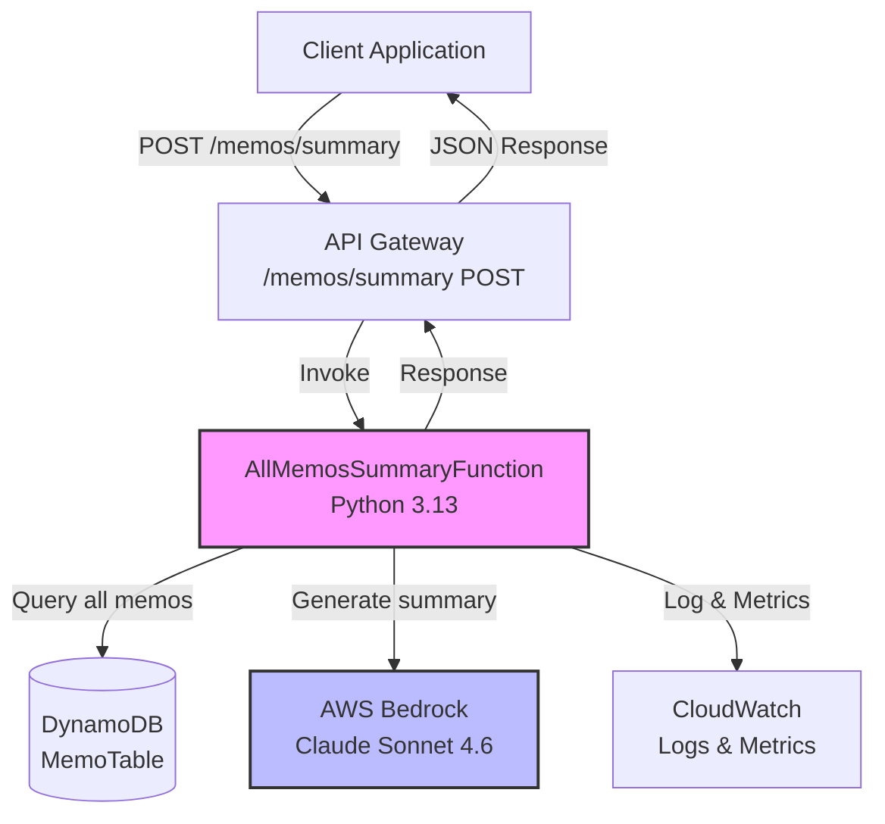

# Design Document: All Memos Summary Feature

## Overview

The All Memos Summary feature extends the existing AI要約API by adding the ability to generate AI-powered summaries of all memos in the system at once. This feature leverages AWS Bedrock Claude Sonnet 4.6 to analyze the complete collection of memos and provide users with a comprehensive overview of themes, patterns, and key information across their entire memo collection.

The feature follows the existing architectural patterns established in the codebase, including:
- Serverless Lambda functions with Python 3.13
- DynamoDB for data persistence using the existing MemoTable
- AWS Bedrock for AI processing with retry logic
- AWS Lambda Powertools for structured logging and metrics
- API Gateway for RESTful endpoints with CORS support

This design addresses the challenge of processing potentially large volumes of memo content while respecting AI model token limits, handling edge cases like empty memo collections, and maintaining the performance and reliability standards of the existing system.

## Architecture

### High-Level Architecture



### Component Interaction Flow

1. Client sends POST request to `/memos/summary` endpoint
2. API Gateway validates request format and invokes AllMemosSummaryFunction
3. Lambda function retrieves all memos from DynamoDB using the existing MemoRepository
4. MemoAggregator component processes and prioritizes memos based on content limits
5. Lambda invokes AWS Bedrock with aggregated memo content
6. Bedrock returns AI-generated summary
7. Lambda constructs response with summary, metadata, and memo counts
8. Response returned to client with proper UTF-8 encoding

### AWS Services Integration

- **Lambda Function**: 65-second timeout, 1024MB memory, Python 3.13 runtime
- **DynamoDB**: Reuses existing MemoTable with UpdatedAtIndex GSI for efficient querying
- **AWS Bedrock**: Claude Sonnet 4.6 model in us-west-2 region with 3 retry attempts
- **API Gateway**: REST API with CORS enabled for web client access
- **CloudWatch**: Structured logging and custom metrics for monitoring

## Components and Interfaces

### 1. AllMemosSummaryFunction (Lambda Handler)

**Location**: `src/functions/all_memos_summary/handler.py`

**Responsibilities**:
- Handle POST /memos/summary API requests
- Orchestrate memo retrieval, aggregation, and AI processing
- Implement error handling and retry logic
- Generate structured logs and CloudWatch metrics
- Return properly formatted JSON responses with UTF-8 encoding

**Key Functions**:

```python
def lambda_handler(event: Dict[str, Any], context: LambdaContext) -> Dict[str, Any]:
    """
    Main Lambda handler for all-memos summary generation.
    
    Args:
        event: API Gateway event (empty body or optional filters)
        context: Lambda context with request_id
        
    Returns:
        API Gateway response with summary or error
    """
    pass

def validate_request(body: Dict[str, Any]) -> None:
    """
    Validate request body format (currently accepts empty body).
    
    Raises:
        ValidationError: If request format is invalid
    """
    pass

def error_response(status_code: int, error_code: str, message: str, request_id: str) -> Dict[str, Any]:
    """
    Create standardized error response with UTF-8 encoding.
    
    Returns:
        API Gateway response dictionary
    """
    pass
```

**Environment Variables**:
- `MEMO_TABLE_NAME`: DynamoDB table name
- `BEDROCK_MODEL_ID`: Model identifier (us.anthropic.claude-sonnet-4-6)
- `BEDROCK_REGION`: AWS region for Bedrock (us-west-2)
- `MAX_RETRIES`: Number of retry attempts (3)
- `MAX_CONTENT_TOKENS`: Maximum tokens for AI processing (180000)
- `LOG_LEVEL`: Logging level (INFO)
- `POWERTOOLS_SERVICE_NAME`: Service name for powertools (ai-summary-api)

### 2. MemoAggregator Component

**Location**: `src/services/memo_aggregator.py`

**Responsibilities**:
- Aggregate multiple memos into a single context string
- Enforce content size limits based on token count
- Prioritize most recently updated memos when limits are exceeded
- Track included vs. total memo counts

**Key Functions**:

```python
class MemoAggregator:
    """Aggregates memos for AI processing with content limit enforcement."""
    
    def __init__(self, max_tokens: int = 180000):
        """
        Initialize aggregator with token limit.
        
        Args:
            max_tokens: Maximum tokens allowed for AI processing
        """
        pass
    
    def aggregate_memos(self, memos: List[Memo]) -> AggregationResult:
        """
        Aggregate memos into a single context string.
        
        Prioritizes most recently updated memos. Includes complete memos only
        (no partial memo content).
        
        Args:
            memos: List of Memo objects sorted by updated_at descending
            
        Returns:
            AggregationResult with aggregated text, included count, total count
        """
        pass
    
    def estimate_tokens(self, text: str) -> int:
        """
        Estimate token count for text (approximation: 1 token ≈ 4 characters).
        
        Args:
            text: Text to estimate
            
        Returns:
            Estimated token count
        """
        pass
```

**Data Structure**:

```python
@dataclass
class AggregationResult:
    """Result of memo aggregation."""
    aggregated_text: str  # Combined memo content
    included_count: int   # Number of memos included
    total_count: int      # Total number of memos available
    truncated: bool       # Whether content was truncated
```

### 3. BedrockService Component

**Location**: `src/services/bedrock_service.py`

**Responsibilities**:
- Invoke AWS Bedrock Claude Sonnet 4.6 model
- Implement exponential backoff retry logic
- Build prompts for all-memos summary generation
- Parse Bedrock responses

**Key Functions**:

```python
class BedrockService:
    """Service for AWS Bedrock AI interactions."""
    
    def __init__(self, model_id: str, region: str, max_retries: int = 3):
        """
        Initialize Bedrock service.
        
        Args:
            model_id: Bedrock model identifier
            region: AWS region
            max_retries: Maximum retry attempts
        """
        pass
    
    def generate_all_memos_summary(
        self,
        aggregated_content: str,
        memo_count: int
    ) -> str:
        """
        Generate summary of all memos using Bedrock.
        
        Args:
            aggregated_content: Combined memo content
            memo_count: Number of memos in the content
            
        Returns:
            AI-generated summary text
            
        Raises:
            ServiceUnavailableError: If retries exhausted
            ClientError: For non-retryable errors
        """
        pass
    
    def build_summary_prompt(self, aggregated_content: str, memo_count: int) -> str:
        """
        Build prompt for all-memos summary generation.
        
        Args:
            aggregated_content: Combined memo content
            memo_count: Number of memos
            
        Returns:
            Formatted prompt string
        """
        pass
    
    def invoke_with_retry(self, request_body: Dict[str, Any]) -> str:
        """
        Invoke Bedrock with exponential backoff retry.
        
        Implements retry logic for ThrottlingException and ServiceUnavailableException.
        Exponential backoff: 1s, 2s, 4s.
        
        Args:
            request_body: Bedrock API request body
            
        Returns:
            AI response text
            
        Raises:
            ServiceUnavailableError: If all retries fail
        """
        pass
```

### 4. Reused Components

**MemoRepository** (`src/repositories/memo_repository.py`):
- Existing component for DynamoDB operations
- Will use `list_memos()` method to retrieve all memos
- Already implements pagination, but we'll retrieve all memos by iterating through pages

**Memo Model** (`src/models/memo.py`):
- Existing data model with validation
- No modifications needed

## Data Models

### Request Model

```python
# POST /memos/summary
# Request body (optional, currently empty for MVP)
{}

# Future enhancement: optional filters
{
    "filters": {
        "date_from": "2024-01-01T00:00:00Z",  # Optional
        "date_to": "2024-12-31T23:59:59Z"      # Optional
    }
}
```

### Response Model

```python
# Success Response (200 OK)
{
    "summary": str,              # AI-generated summary text
    "metadata": {
        "model_id": str,         # Bedrock model identifier
        "processing_time_ms": int,  # Processing time in milliseconds
        "memos_included": int,   # Number of memos included in summary
        "memos_total": int,      # Total number of memos in system
        "truncated": bool        # Whether content was truncated due to limits
    }
}

# Empty Memos Response (200 OK)
{
    "summary": "メモが存在しないため、要約を生成できません。",
    "metadata": {
        "model_id": str,
        "processing_time_ms": int,
        "memos_included": 0,
        "memos_total": 0,
        "truncated": false
    }
}

# Error Response (4xx, 5xx)
{
    "error": {
        "code": str,           # Error code (ValidationError, ServiceUnavailable, etc.)
        "message": str,        # Human-readable error message
        "request_id": str      # Request ID for tracing
    }
}
```

### Internal Data Models

```python
@dataclass
class AggregationResult:
    """Result of memo aggregation for AI processing."""
    aggregated_text: str
    included_count: int
    total_count: int
    truncated: bool

@dataclass
class SummaryMetadata:
    """Metadata for summary response."""
    model_id: str
    processing_time_ms: int
    memos_included: int
    memos_total: int
    truncated: bool
```

### DynamoDB Schema (Existing)

The feature reuses the existing MemoTable schema:

```
Table: MemoTable
- PK (HASH): "MEMO#{uuid}"
- id: UUID string
- title: String (1-200 chars)
- content: String (1-50000 chars)
- created_at: ISO 8601 timestamp
- updated_at: ISO 8601 timestamp
- entity_type: "MEMO"

GSI: UpdatedAtIndex
- entity_type (HASH): "MEMO"
- updated_at (RANGE): ISO 8601 timestamp
- Projection: ALL
```


## Correctness Properties

*A property is a characteristic or behavior that should hold true across all valid executions of a system—essentially, a formal statement about what the system should do. Properties serve as the bridge between human-readable specifications and machine-verifiable correctness guarantees.*

### Property Reflection

After analyzing all acceptance criteria, I identified several areas where properties can be consolidated to eliminate redundancy:

- Properties 1.4, 2.3, 2.4, and 5.3 all relate to response structure and can be combined into a comprehensive response validation property
- Properties 4.4, 6.1, and 6.3 all relate to logging structure and can be combined into a single logging property
- Properties 7.3 and 7.4 relate to successful response format and can be combined with the response structure property
- Properties 1.1 and 1.2 can be combined into a single property about memo retrieval and aggregation

The following properties represent the unique, non-redundant validation requirements:

### Property 1: Complete Memo Retrieval and Aggregation

*For any* collection of memos in the system, when a summary request is made, all memos should be retrieved from DynamoDB and their content should be included in the aggregated text (subject to content limits).

**Validates: Requirements 1.1, 1.2**

### Property 2: Bedrock Invocation with Correct Parameters

*For any* valid aggregated memo content, the system should invoke AWS Bedrock Claude Sonnet 4.6 with properly formatted request body including the correct model ID, anthropic version, and aggregated content in the messages array.

**Validates: Requirements 1.3**

### Property 3: Response Structure Completeness

*For any* successful summary request, the response should contain all required fields: summary text, model_id, processing_time_ms (positive integer), memos_included (non-negative integer), memos_total (non-negative integer), and truncated (boolean), with proper UTF-8 encoding and CORS headers.

**Validates: Requirements 1.4, 1.5, 2.3, 2.4, 5.3, 7.3, 7.4**

### Property 4: Recency-Based Prioritization Under Limits

*For any* collection of memos where total content exceeds the token limit, the aggregated result should include memos in descending order by updated_at timestamp, maximizing the number of complete memos within the limit.

**Validates: Requirements 2.1, 2.2**

### Property 5: Retry Logic with Exponential Backoff

*For any* retryable Bedrock error (ThrottlingException, ServiceUnavailableException), the system should retry up to 3 times with exponential backoff delays of 1s, 2s, and 4s between attempts.

**Validates: Requirements 4.1**

### Property 6: Error Response Structure

*For any* error condition (DynamoDB errors, validation errors, service unavailable), the system should return a properly structured error response with error code, message, request_id, and appropriate HTTP status code (400, 500, 503).

**Validates: Requirements 4.2, 4.3, 7.5**

### Property 7: Structured Logging Completeness

*For any* request (successful or failed), the system should emit structured JSON logs containing request_id, and for successful requests: number of memos processed, processing time, and status; for errors: error type, error message, and stack trace.

**Validates: Requirements 4.4, 6.1, 6.3**

### Property 8: CloudWatch Metrics Emission

*For any* request, the system should emit CloudWatch metrics for request count, and for successful requests: processing time and number of memos processed; for errors: error count with error type dimension.

**Validates: Requirements 6.2**

### Property 9: Request Validation

*For any* request body, the system should accept empty JSON objects and valid filter parameters (if provided), and reject malformed JSON or invalid filter formats with a 400 status code.

**Validates: Requirements 7.2, 7.5**

### Edge Case Examples

The following specific scenarios should be tested as examples rather than properties:

**Example 1: Empty Memo Collection**
- When no memos exist in the system, return 200 with message "メモが存在しないため、要約を生成できません。"
- Response should have memos_included=0, memos_total=0, truncated=false
- Bedrock should not be invoked
- **Validates: Requirements 3.1, 3.2, 3.3**

**Example 2: All Retries Exhausted**
- When Bedrock returns retryable errors 3 times, return 503 with descriptive error message
- **Validates: Requirements 4.2**

**Example 3: API Endpoint Existence**
- POST /memos/summary endpoint should exist and be accessible
- **Validates: Requirements 7.1**

## Error Handling

### Error Categories and Responses

**1. Validation Errors (400 Bad Request)**
- Invalid JSON in request body
- Invalid filter parameters (future enhancement)
- Response: `{"error": {"code": "ValidationError", "message": "...", "request_id": "..."}}`

**2. Resource Not Found (404 Not Found)**
- Not applicable for this endpoint (no resource ID in path)

**3. Service Unavailable (503 Service Unavailable)**
- Bedrock throttling after all retries exhausted
- Bedrock service unavailable after all retries
- Response: `{"error": {"code": "ServiceUnavailable", "message": "AI service temporarily unavailable. Please try again later.", "request_id": "..."}}`

**4. Internal Server Error (500 Internal Server Error)**
- DynamoDB errors (connection, permission, etc.)
- Unexpected exceptions
- Response: `{"error": {"code": "InternalError", "message": "An unexpected error occurred", "request_id": "..."}}`

**5. Gateway Timeout (504 Gateway Timeout)**
- Lambda execution exceeds 65 seconds (handled by API Gateway)
- Response: API Gateway default timeout response

### Retry Strategy

**Bedrock Retries:**
- Retryable errors: `ThrottlingException`, `ServiceUnavailableException`
- Max retries: 3 attempts
- Backoff: Exponential (1s, 2s, 4s)
- Non-retryable errors: Immediate failure with appropriate error code

**DynamoDB Retries:**
- Handled by boto3 default retry logic (3 attempts with exponential backoff)
- No custom retry logic needed

### Error Logging

All errors must be logged with:
- Error type (exception class name)
- Error message
- Stack trace (for unexpected errors)
- Request ID for tracing
- Context: memo count, processing stage, etc.

Example log structure:
```json
{
  "level": "ERROR",
  "timestamp": "2024-01-15T10:30:45.123Z",
  "request_id": "abc-123-def",
  "error_type": "ServiceUnavailableError",
  "error_message": "AI service temporarily unavailable",
  "context": {
    "memos_retrieved": 50,
    "stage": "bedrock_invocation",
    "retry_attempt": 3
  },
  "stack_trace": "..."
}
```

## Testing Strategy

### Dual Testing Approach

This feature requires both unit tests and property-based tests for comprehensive coverage:

**Unit Tests** focus on:
- Specific examples (empty memo collection, single memo, multiple memos)
- Edge cases (retry exhaustion, timeout scenarios)
- Error conditions (DynamoDB errors, Bedrock errors)
- Integration points (API Gateway event parsing, response formatting)

**Property-Based Tests** focus on:
- Universal properties across all inputs (response structure, memo aggregation)
- Randomized input generation (varying memo counts, content sizes, timestamps)
- Comprehensive coverage through 100+ iterations per property

### Property-Based Testing Configuration

**Library**: `hypothesis` (Python property-based testing library)

**Configuration**:
- Minimum 100 iterations per property test
- Each test tagged with: `# Feature: all-memos-summary, Property {number}: {property_text}`
- Use custom generators for Memo objects with realistic data
- Use `@given` decorator with appropriate strategies

**Example Property Test Structure**:
```python
from hypothesis import given, strategies as st
import hypothesis

# Feature: all-memos-summary, Property 3: Response Structure Completeness
@given(
    memos=st.lists(
        st.builds(Memo, ...),
        min_size=1,
        max_size=100
    )
)
@hypothesis.settings(max_examples=100)
def test_response_structure_completeness(memos):
    """
    For any successful summary request, the response should contain
    all required fields with proper types and UTF-8 encoding.
    """
    # Test implementation
    pass
```

### Unit Test Coverage

**Handler Tests** (`tests/unit/test_all_memos_summary_handler.py`):
- Empty memo collection (example)
- Valid request with memos
- Invalid JSON request body
- DynamoDB error handling
- Bedrock retry exhaustion (example)
- Response structure validation
- UTF-8 encoding with Japanese characters

**MemoAggregator Tests** (`tests/unit/test_memo_aggregator.py`):
- Aggregation within limits
- Aggregation exceeding limits (prioritization)
- Empty memo list
- Single memo
- Token estimation accuracy

**BedrockService Tests** (`tests/unit/test_bedrock_service.py`):
- Successful invocation
- Retry logic with retryable errors
- Non-retryable error handling
- Prompt building
- Response parsing

### Integration Tests

**API Integration** (`tests/integration/test_all_memos_summary_api.py`):
- End-to-end API request/response flow
- DynamoDB integration (using local DynamoDB or moto)
- Bedrock integration (using mocked Bedrock client)
- CORS header validation
- Error response formats

### Property-Based Test Mapping

Each correctness property maps to a property-based test:

1. **Property 1** → `test_complete_memo_retrieval_and_aggregation`
2. **Property 2** → `test_bedrock_invocation_parameters`
3. **Property 3** → `test_response_structure_completeness`
4. **Property 4** → `test_recency_based_prioritization`
5. **Property 5** → `test_retry_exponential_backoff`
6. **Property 6** → `test_error_response_structure`
7. **Property 7** → `test_structured_logging_completeness`
8. **Property 8** → `test_cloudwatch_metrics_emission`
9. **Property 9** → `test_request_validation`

### Test Data Generators

**Hypothesis Strategies**:
```python
# Memo generator
memo_strategy = st.builds(
    Memo,
    id=st.uuids().map(str),
    title=st.text(min_size=1, max_size=200),
    content=st.text(min_size=1, max_size=50000),
    created_at=st.datetimes(),
    updated_at=st.datetimes()
)

# Japanese text generator for UTF-8 testing
japanese_text_strategy = st.text(
    alphabet=st.characters(
        whitelist_categories=('Lu', 'Ll', 'Nd'),
        whitelist_characters='あいうえおかきくけこ日本語テスト'
    ),
    min_size=1,
    max_size=1000
)
```

### Mocking Strategy

**Bedrock Client**: Mock using `unittest.mock` or `moto`
- Mock successful responses
- Mock retryable errors (ThrottlingException)
- Mock non-retryable errors
- Verify invocation parameters

**DynamoDB**: Use `moto` for local DynamoDB simulation
- Create test table with same schema
- Populate with test data
- Verify query operations

**CloudWatch Metrics**: Mock using `unittest.mock`
- Verify metric names and values
- Verify dimensions

### Test Execution

```bash
# Run all tests
pytest tests/

# Run unit tests only
pytest tests/unit/

# Run property-based tests only
pytest tests/property/

# Run with coverage
pytest --cov=src --cov-report=html

# Run specific property test
pytest tests/property/test_all_memos_summary_properties.py::test_response_structure_completeness -v
```

### Performance Testing

While not part of unit/property tests, performance should be validated:
- Test with 1000+ memos to verify aggregation performance
- Measure Lambda cold start time
- Verify Bedrock invocation stays under 60 seconds
- Monitor memory usage with varying memo counts

