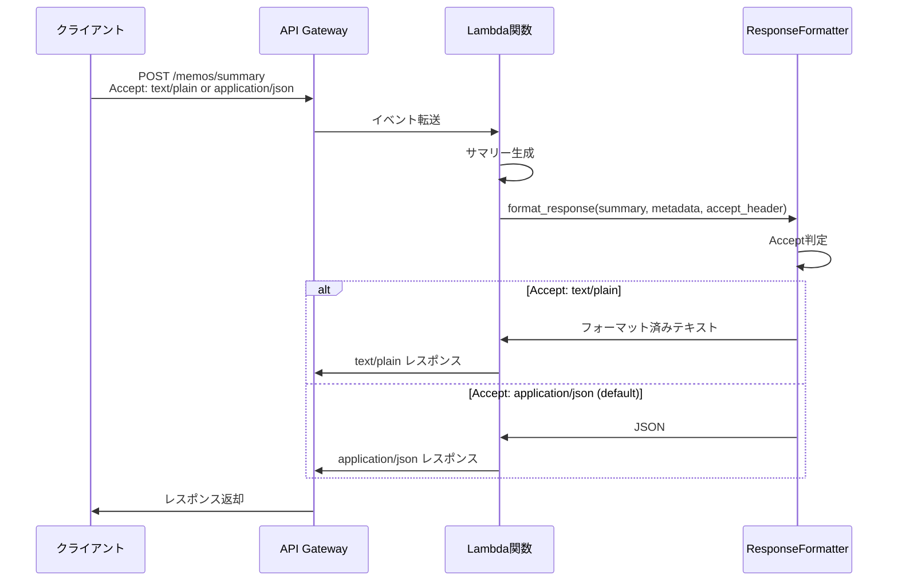

# Design Document: API Response Formatting

## Overview

現在のAPI（`/memos/summary`エンドポイント）は、ターミナルで読みにくい生のJSON形式でレスポンスを返します。この機能は、クライアント側でフォーマット処理を行わずに、API自体が読みやすい形式でレスポンスを返すようにします。

## Main Algorithm/Workflow



## Core Interfaces/Types

```python
from typing import Dict, Any, Optional
from enum import Enum

class ResponseFormat(Enum):
    """レスポンスフォーマットの種類"""
    JSON = "application/json"
    TEXT = "text/plain"

class FormattedResponse:
    """フォーマット済みレスポンスデータ"""
    content: str
    content_type: str
    status_code: int
    headers: Dict[str, str]

class ResponseFormatter:
    """レスポンスフォーマッター"""
    
    def format_response(
        self,
        summary: str,
        metadata: Dict[str, Any],
        accept_header: Optional[str] = None
    ) -> FormattedResponse:
        """
        サマリーレスポンスをフォーマット
        
        Args:
            summary: AI生成サマリーテキスト
            metadata: メタデータ（処理時間、メモ数など）
            accept_header: Acceptヘッダー値
            
        Returns:
            フォーマット済みレスポンス
        """
        pass
    
    def format_as_text(
        self,
        summary: str,
        metadata: Dict[str, Any]
    ) -> str:
        """
        テキスト形式でフォーマット
        
        Args:
            summary: AI生成サマリーテキスト
            metadata: メタデータ
            
        Returns:
            読みやすいテキスト形式の文字列
        """
        pass
    
    def format_as_json(
        self,
        summary: str,
        metadata: Dict[str, Any]
    ) -> str:
        """
        JSON形式でフォーマット（既存形式）
        
        Args:
            summary: AI生成サマリーテキスト
            metadata: メタデータ
            
        Returns:
            JSON文字列
        """
        pass
```

## Key Functions with Formal Specifications

### Function 1: format_response()

```python
def format_response(
    summary: str,
    metadata: Dict[str, Any],
    accept_header: Optional[str] = None
) -> FormattedResponse:
    """メインフォーマット関数"""
    pass
```

**Preconditions:**
- `summary` is non-empty string
- `metadata` is valid dictionary with required keys: `model_id`, `processing_time_ms`, `memos_included`, `memos_total`, `truncated`
- `accept_header` is None or valid HTTP Accept header string

**Postconditions:**
- Returns valid FormattedResponse object
- `content` is properly formatted based on Accept header
- `content_type` matches the format used
- `headers` include proper CORS and encoding headers
- No mutations to input parameters

**Loop Invariants:** N/A

### Function 2: format_as_text()

```python
def format_as_text(summary: str, metadata: Dict[str, Any]) -> str:
    """テキスト形式フォーマット"""
    pass
```

**Preconditions:**
- `summary` is non-empty string
- `metadata` contains all required keys with valid types

**Postconditions:**
- Returns formatted text string with visual separators
- Includes header section with metadata
- Includes summary content section
- Uses UTF-8 compatible characters (emoji, Japanese text)
- Output is human-readable in terminal

**Loop Invariants:** N/A

### Function 3: parse_accept_header()

```python
def parse_accept_header(accept_header: Optional[str]) -> ResponseFormat:
    """Acceptヘッダーをパース"""
    pass
```

**Preconditions:**
- `accept_header` is None or string

**Postconditions:**
- Returns ResponseFormat enum value
- Defaults to JSON if header is None or invalid
- Handles wildcard (*/*) and quality values (q=)
- Returns TEXT if "text/plain" is preferred

**Loop Invariants:**
- For parsing loop: All previously parsed media types remain valid


## Algorithmic Pseudocode

### Main Response Formatting Algorithm

```python
ALGORITHM format_response(summary, metadata, accept_header)
INPUT: summary (string), metadata (dict), accept_header (optional string)
OUTPUT: FormattedResponse object

BEGIN
  ASSERT summary is not empty
  ASSERT metadata contains required keys
  
  // Step 1: Determine response format from Accept header
  response_format ← parse_accept_header(accept_header)
  
  // Step 2: Format content based on determined format
  IF response_format = ResponseFormat.TEXT THEN
    content ← format_as_text(summary, metadata)
    content_type ← "text/plain; charset=utf-8"
  ELSE
    content ← format_as_json(summary, metadata)
    content_type ← "application/json; charset=utf-8"
  END IF
  
  // Step 3: Build response headers
  headers ← {
    "Content-Type": content_type,
    "Access-Control-Allow-Origin": "*",
    "Access-Control-Allow-Methods": "POST, OPTIONS",
    "Access-Control-Allow-Headers": "Content-Type, Accept"
  }
  
  // Step 4: Create response object
  response ← FormattedResponse(
    content=content,
    content_type=content_type,
    status_code=200,
    headers=headers
  )
  
  ASSERT response.content is not empty
  ASSERT response.content_type is valid
  
  RETURN response
END
```

**Preconditions:**
- summary is non-empty string
- metadata is valid dictionary with required keys
- accept_header is None or valid HTTP header string

**Postconditions:**
- Returns valid FormattedResponse object
- content is properly formatted
- headers include CORS and encoding information
- No side effects on input parameters

**Loop Invariants:** N/A

### Accept Header Parsing Algorithm

```python
ALGORITHM parse_accept_header(accept_header)
INPUT: accept_header (optional string)
OUTPUT: ResponseFormat enum value

BEGIN
  // Default to JSON if no header provided
  IF accept_header is None OR accept_header is empty THEN
    RETURN ResponseFormat.JSON
  END IF
  
  // Parse media types with quality values
  media_types ← []
  
  FOR each media_type_str IN split(accept_header, ",") DO
    parts ← split(trim(media_type_str), ";")
    media_type ← trim(parts[0])
    
    // Extract quality value (default 1.0)
    quality ← 1.0
    IF length(parts) > 1 THEN
      FOR each param IN parts[1:] DO
        IF starts_with(trim(param), "q=") THEN
          quality ← parse_float(substring(param, 2))
        END IF
      END FOR
    END IF
    
    media_types.append((media_type, quality))
  END FOR
  
  // Sort by quality value (descending)
  sort(media_types, key=quality, reverse=true)
  
  // Find first matching format
  FOR each (media_type, quality) IN media_types DO
    IF media_type = "text/plain" THEN
      RETURN ResponseFormat.TEXT
    ELSE IF media_type = "application/json" THEN
      RETURN ResponseFormat.JSON
    ELSE IF media_type = "*/*" THEN
      RETURN ResponseFormat.JSON  // Default for wildcard
    END IF
  END FOR
  
  // Default to JSON if no match
  RETURN ResponseFormat.JSON
END
```

**Preconditions:**
- accept_header is None or string

**Postconditions:**
- Returns valid ResponseFormat enum value
- Never returns None
- Handles malformed headers gracefully

**Loop Invariants:**
- All parsed media types have valid quality values (0.0 to 1.0)
- Media types list remains sorted by quality after sorting step

### Text Formatting Algorithm

```python
ALGORITHM format_as_text(summary, metadata)
INPUT: summary (string), metadata (dict)
OUTPUT: formatted text string

BEGIN
  ASSERT summary is not empty
  ASSERT metadata contains required keys
  
  // Initialize output buffer
  output ← []
  
  // Step 1: Add header section
  output.append("\n" + "="*80)
  output.append("📝 メモ要約結果")
  output.append("="*80 + "\n")
  
  // Step 2: Add metadata section
  output.append("📊 処理情報:")
  
  processing_time_ms ← metadata["processing_time_ms"]
  IF processing_time_ms > 0 THEN
    processing_time_sec ← processing_time_ms / 1000.0
    output.append(f"  • 処理時間: {processing_time_sec:.2f}秒")
  ELSE
    output.append("  • 処理時間: N/A")
  END IF
  
  memos_included ← metadata["memos_included"]
  memos_total ← metadata["memos_total"]
  output.append(f"  • 要約対象: {memos_included}/{memos_total}件のメモ")
  
  model_id ← metadata.get("model_id", "N/A")
  output.append(f"  • モデル: {model_id}")
  
  truncated ← metadata["truncated"]
  truncated_text ← "あり" IF truncated ELSE "なし"
  output.append(f"  • 切り詰め: {truncated_text}")
  
  output.append("\n" + "-"*80 + "\n")
  
  // Step 3: Add summary content
  output.append("📄 要約内容:\n")
  output.append(summary)
  output.append("\n" + "="*80 + "\n")
  
  // Step 4: Join all parts
  result ← join(output, "\n")
  
  ASSERT result is not empty
  ASSERT result contains summary text
  
  RETURN result
END
```

**Preconditions:**
- summary is non-empty string
- metadata contains all required keys with valid types

**Postconditions:**
- Returns formatted text string with visual separators
- Includes all metadata fields
- Uses UTF-8 compatible characters
- Output is human-readable

**Loop Invariants:**
- For metadata iteration: All appended lines are valid UTF-8 strings

## Example Usage

```python
# Example 1: Basic usage with text format
from utils.response_formatter import ResponseFormatter

formatter = ResponseFormatter()
summary = "## メモの包括的な要約\n\n業務タスクの要約..."
metadata = {
    "model_id": "us.anthropic.claude-sonnet-4-6",
    "processing_time_ms": 11263,
    "memos_included": 3,
    "memos_total": 3,
    "truncated": False
}

# Client requests text/plain format
response = formatter.format_response(
    summary=summary,
    metadata=metadata,
    accept_header="text/plain"
)

# Returns formatted text response
assert response.content_type == "text/plain; charset=utf-8"
assert "📝 メモ要約結果" in response.content
```

```python
# Example 2: Default JSON format (backward compatibility)
response = formatter.format_response(
    summary=summary,
    metadata=metadata,
    accept_header=None  # or "application/json"
)

# Returns JSON response (existing format)
assert response.content_type == "application/json; charset=utf-8"
import json
body = json.loads(response.content)
assert "summary" in body
assert "metadata" in body
```

```python
# Example 3: Accept header with quality values
response = formatter.format_response(
    summary=summary,
    metadata=metadata,
    accept_header="text/plain;q=0.9, application/json;q=0.8"
)

# Prefers text/plain due to higher quality value
assert response.content_type == "text/plain; charset=utf-8"
```

```python
# Example 4: Integration with Lambda handler
def lambda_handler(event: Dict[str, Any], context: LambdaContext) -> Dict[str, Any]:
    # ... generate summary and metadata ...
    
    # Get Accept header from request
    accept_header = event.get("headers", {}).get("Accept")
    
    # Format response
    formatter = ResponseFormatter()
    formatted = formatter.format_response(
        summary=summary_text,
        metadata=metadata,
        accept_header=accept_header
    )
    
    # Return API Gateway response
    return {
        "statusCode": formatted.status_code,
        "headers": formatted.headers,
        "body": formatted.content
    }
```

## Correctness Properties

*A property is a characteristic or behavior that should hold true across all valid executions of a system—essentially, a formal statement about what the system should do. Properties serve as the bridge between human-readable specifications and machine-verifiable correctness guarantees.*

### Property 1: Content Type Matches Accept Header

*For any* valid summary, metadata, and Accept header, the response Content-Type should match the format specified in the Accept header, with text/plain for text requests, application/json for JSON requests or when no header is provided, and proper charset=utf-8 encoding.

**Validates: Requirements 1.1, 1.2, 1.3, 5.1**

### Property 2: Quality Value Selection

*For any* valid summary and metadata, when an Accept header contains multiple media types with quality values, the response format should be the one with the highest quality value.

**Validates: Requirements 1.4, 7.2, 7.3**

### Property 3: Wildcard and Default Handling

*For any* valid summary and metadata, when the Accept header is "*/*", empty string, None, or contains unsupported media types, the response should default to application/json format.

**Validates: Requirements 1.5, 9.3, 9.4, 9.5**

### Property 4: Text Format Visual Elements

*For any* valid summary and metadata, when formatted as text, the response should include visual separators (= and - characters), emoji icons (📝, 📊, 📄), bullet points for metadata, and clearly separated summary content.

**Validates: Requirements 2.1, 2.2, 2.3, 2.4**

### Property 5: Processing Time Formatting

*For any* valid summary and metadata, when formatted as text and processing_time_ms is greater than zero, the response should display processing time in seconds with two decimal places.

**Validates: Requirements 2.5, 4.6**

### Property 6: JSON Structure Preservation

*For any* valid summary and metadata, when formatted as JSON, the response should contain "summary" and "metadata" fields, with all metadata fields (model_id, processing_time_ms, memos_included, memos_total, truncated) preserved in their original structure.

**Validates: Requirements 3.2, 3.3, 3.4**

### Property 7: Metadata Completeness

*For any* valid summary and metadata, the response should include all metadata fields: model_id, processing_time_ms, memos_included, memos_total, and truncated flag.

**Validates: Requirements 4.1, 4.2, 4.3, 4.4, 4.5**

### Property 8: Content Preservation

*For any* valid summary, metadata, and Accept header, the summary content should be included in the response regardless of the output format.

**Validates: Requirements 2.4, 3.2**

### Property 9: UTF-8 Character Preservation

*For any* summary containing Japanese characters, emoji, or other Unicode characters, these characters should be correctly preserved in both text and JSON formats.

**Validates: Requirements 5.2, 5.3, 5.4**

### Property 10: CORS Headers Presence

*For any* valid summary, metadata, and Accept header, the response should include all required CORS headers: Access-Control-Allow-Origin with value "*", Access-Control-Allow-Methods with value "POST, OPTIONS", and Access-Control-Allow-Headers with value "Content-Type, Accept".

**Validates: Requirements 6.1, 6.2, 6.3**

### Property 11: Accept Header Parsing

*For any* Accept header with multiple media types separated by commas and optional whitespace, the parser should correctly extract each media type, trim whitespace, and parse quality values.

**Validates: Requirements 7.1, 7.5**

### Property 12: Malformed Header Handling

*For any* invalid or malformed Accept header, the parser should gracefully default to JSON format without throwing errors.

**Validates: Requirements 7.4**

### Property 13: Response Structure Completeness

*For any* valid summary, metadata, and Accept header, the response object should include all required fields: non-empty content, valid content_type, valid status_code, and headers dictionary.

**Validates: Requirements 8.1, 8.2, 8.3, 8.4**

### Property 14: Input Immutability

*For any* valid summary, metadata, and Accept header, calling format_response should not mutate any of the input parameters.

**Validates: Requirements 8.5**
